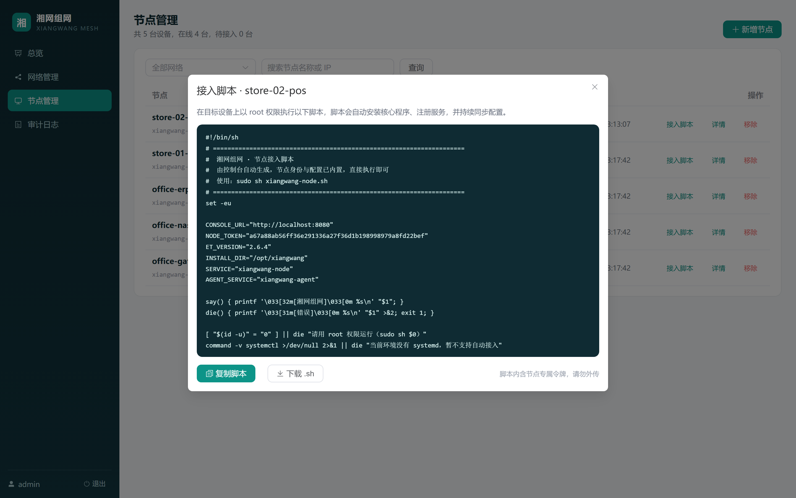
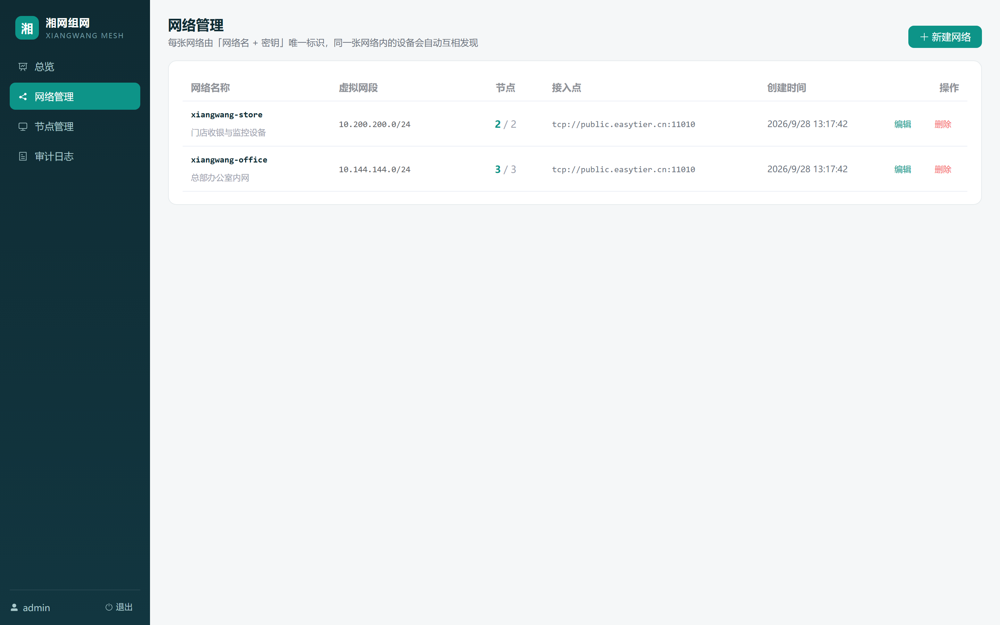

# 湘网组网 · XiangWang Mesh

> 面向中小场景的异地组网与设备互联管理平台

把分散在几个地方的设备，连成一张属于自己的内网。不需要公网 IP，不需要懂网络配置。

---

## 功能特性

| 模块 | 能力 |
|---|---|
| 网络管理 | 创建/编辑网络，密钥随机生成，虚拟网段与接入点可配 |
| 节点接入 | 自动分配虚拟 IP，一键生成接入脚本，目标设备执行即上线 |
| 状态监控 | 节点心跳上报（30 秒一次），在线/离线/待接入一眼看清 |
| 配置下发 | 网络或节点参数变更后自动同步到设备，无需登录每台机器 |
| 配置快照 | 每次参数变更留档，可回滚到任意历史版本 |
| 审计日志 | 谁在什么时候改了什么，全部留痕 |
| 总览看板 | 网络数、节点数、在线率、最近操作 |

## 界面预览

| 总览 | 节点管理 |
|---|---|
|  |  |

| 接入脚本 | 网络管理 |
|---|---|
|  |  |

## 快速开始

### 方式一：Docker（推荐）

```bash
# 1. 准备环境变量
cat > .env <<'EOF'
CONSOLE_URL=http://你的控制台地址:8080
ADMIN_USER=admin
ADMIN_PASSWORD=请改成强密码
EOF

# 2. 启动
docker compose up -d --build

# 3. 访问
open http://localhost:8080
```

### 方式二：本地开发

```bash
# 后端（终端 1）
cd server
npm install
npm run dev          # 监听 http://localhost:8080

# 前端（终端 2）
cd web
npm install
npm run dev          # 监听 http://localhost:5173，API 自动代理到 8080
```

首次启动时服务端会自动创建管理员账号，账号密码打印在服务端日志里。

**生产部署**：先 `cd web && npm run build`，构建产物会由后端直接托管，只需跑后端一个进程。

### 接入第一台设备

1. 登录控制台 → **网络管理** → 新建网络（也可直接用默认网段）
2. **节点管理** → 新增节点 → 填写名称 → 点「接入脚本」
3. 复制脚本，到目标设备上以 root 权限执行：

```bash
sudo sh xiangwang-node.sh
```

4. 回到控制台刷新，节点状态变为「在线」

## 目录结构

```
xiangwang-mesh/
├── server/                 控制台后端（Node.js + Express + node:sqlite）
│   ├── src/
│   │   ├── index.js        服务入口
│   │   ├── db.js           数据库结构与初始化
│   │   ├── auth.js         账号、令牌与鉴权
│   │   ├── routes/         API 路由
│   │   ├── services/       配置生成、审计
│   │   └── templates/      节点接入脚本模板
│   └── data/               运行时数据（git 忽略）
├── web/                    控制台前端（Vue 3 + Vite + Element Plus）
├── docs/
│   ├── ARCHITECTURE.md     架构设计与关键取舍
│   └── ROADMAP.md          迭代计划
├── Dockerfile
└── docker-compose.yml
```

## 工作原理

```
湘网组网控制台  ──①下发配置──▶  节点代理  ──▶  easytier-core
      ▲                                            │
      └──────────②心跳上报──────────────────────────┘
                                                   │
                                            ③P2P 直连（数据面）
                                                   ▼
                                                其他节点
```

- **控制面自研**：配置生成、下发、快照、审计全部由本项目管理
- **数据面复用上游**：加密、NAT 穿透、路由由 EasyTier 开源核心提供
- 节点上的代理每 30 秒上报心跳并拉取配置，配置有变化时自动重启核心服务

详见 [docs/ARCHITECTURE.md](docs/ARCHITECTURE.md)。

## 与 EasyTier 的关系

本项目**使用** EasyTier 的开源核心（`easytier-core`），**不修改其源码**，通过命令行参数调用。

- EasyTier 以 **LGPL-3.0** 发布（注意：网上大量教程仍写作 Apache-2.0，那是历史信息）
- 本项目的控制面代码与 EasyTier 相互独立，不构成衍生作品
- 分发本产品时请一并保留 EasyTier 的许可证与声明，见 [THIRD-PARTY-NOTICES.md](THIRD-PARTY-NOTICES.md)

「EasyTier」名称与标识归其作者所有，本项目不以之进行宣传，产品品牌为「湘网组网」。

## 技术栈

| 层 | 选型 |
|---|---|
| 前端 | Vue 3 + Vite + Element Plus + Vue Router |
| 后端 | Node.js 22 + Express 4 |
| 数据库 | SQLite（`node:sqlite`，无需额外服务） |
| 节点侧 | 官方 easytier-core 二进制 + Shell 代理（systemd） |

## 开发约定

- 后端使用 ESM，启动需带 `--experimental-sqlite`
- 所有配置变更必须写入 `node_configs` 快照与 `audit_logs`
- 不引入需要编译的原生依赖，保持跨平台可部署

## 路线图

见 [docs/ROADMAP.md](docs/ROADMAP.md)。

## 许可证

本项目代码的授权方式待定（当前为保留所有权利）。任何对外分发前请先确定授权策略，并确保已阅读 [THIRD-PARTY-NOTICES.md](THIRD-PARTY-NOTICES.md)。
