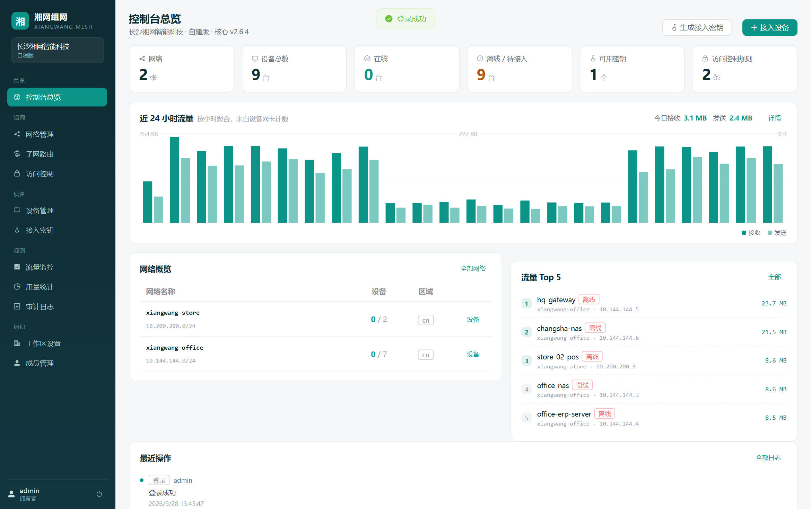
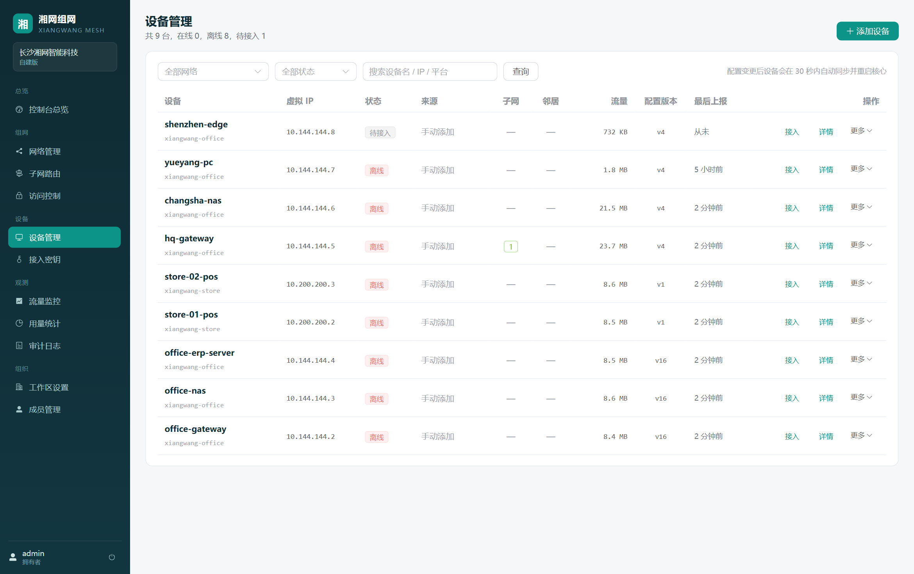
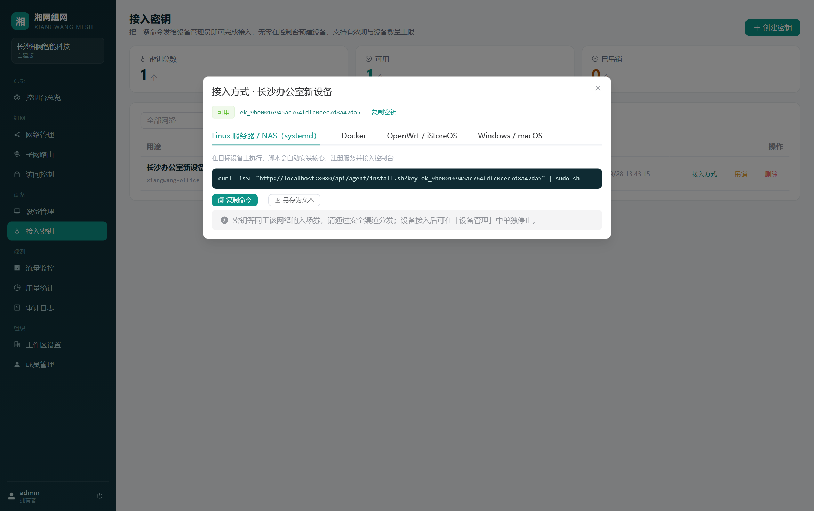
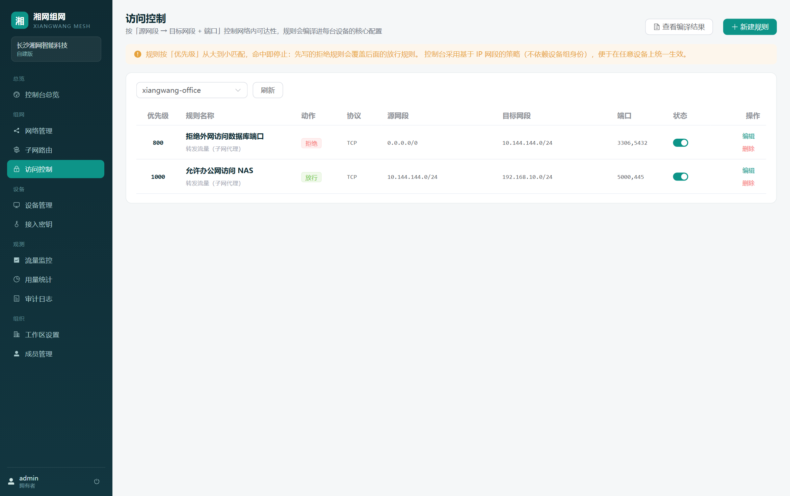
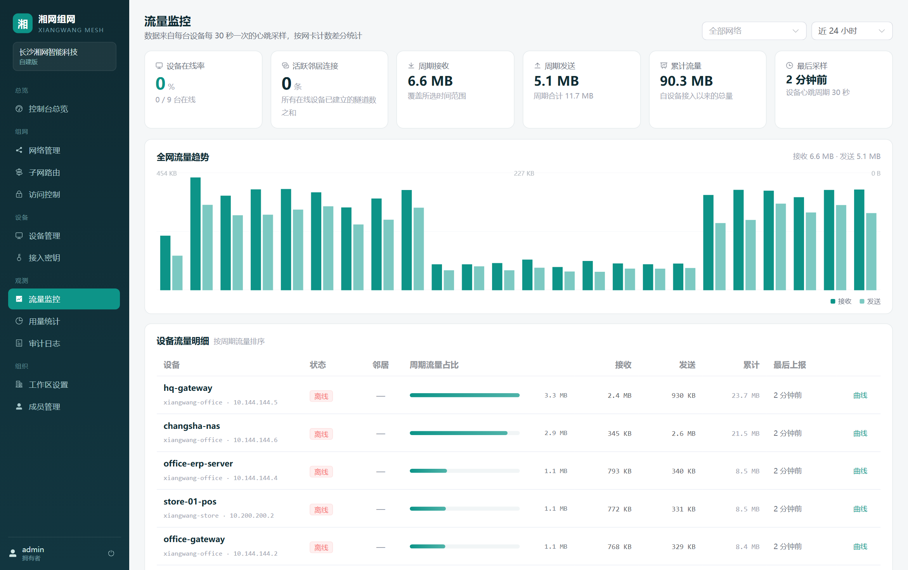
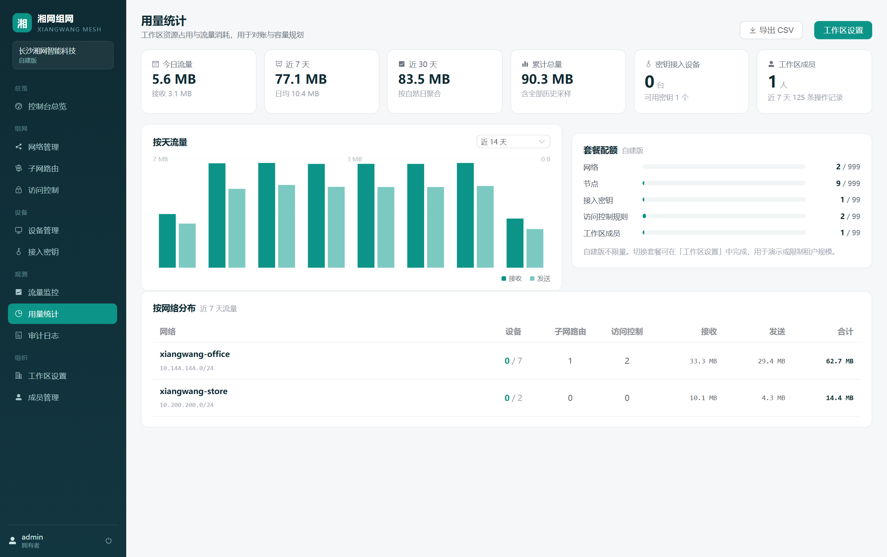

# 湘网组网 · XiangWang Mesh

> 面向中小场景的**自建异地组网管理平台** —— 把分散在各地的设备连成一张属于自己的内网

不需要公网 IP，不需要懂网络配置，**不依赖任何第三方组网云**。控制台跑在你自己的服务器上，组网流量走设备之间的 P2P 直连。

---

## 功能特性

| 分组 | 模块 | 能力 |
| --- | --- | --- |
| **组网** | 网络管理 | 创建/编辑网络，密钥随机生成，虚拟网段、接入点、中继模式（自动/强制中继/仅 P2P）、资源地域可配 |
| | 子网路由 | 把设备背后的整个局域网（如 `192.168.88.0/24`）代理进虚拟网，异地直接访问内网设备 |
| | 访问控制 | 入站 / 出站 / 转发三类链路，按 IP 段、协议、端口设规则，优先级可调，实时预览编译结果 |
| **设备** | 设备管理 | 自动分配虚拟 IP，一键生成接入脚本，状态实时可见（在线/离线/待接入/已停止） |
| | 接入密钥 | 一条密钥批量放行设备自助接入，可设有效期与设备上限，支持吊销与用量统计 |
| | 设备管控 | 远程停止 / 恢复设备、重发配置、查看配置版本与配置快照 |
| | 配置下发 | 变更后自动同步到设备，无需逐台登录；**下发前先做 8 秒配置预检**，坏配置不会让设备掉线 |
| **观测** | 流量监控 | 网卡级出入流量采样，全网趋势图 + 单设备曲线 + 流量占比排行 |
| | 用量视图 | 今日/本周/30 天/累计流量、按网络分布、按天明细、CSV 导出 |
| **组织** | 工作区 | 多租户隔离，所有资源按工作区划分 |
| | 成员角色 | 拥有者 / 管理员 / 成员 / 只读，四档权限逐级收敛 |
| | 审计日志 | 约 35 类操作全量留痕，支持按动作、操作者、关键词、时间筛选与 CSV 导出 |
| | 总览看板 | 网络数、设备数、在线率、流量汇总、最近操作 |

## 界面预览

| 总览看板 | 设备管理 |
| --- | --- |
|  |  |

| 接入密钥与众平台接入方式 | 访问控制规则 |
| --- | --- |
|  |  |

| 流量监控 | 用量视图 |
| --- | --- |
|  |  |

> 更多界面见 [`docs/screenshots/`](docs/screenshots/)。

---

## 快速开始

### 方式一：宝塔面板 + Docker（推荐生产使用）

完整步骤见 **[docs/DEPLOY-BAOTA.md](docs/DEPLOY-BAOTA.md)**，含反向代理、HTTPS、备份、升级与故障排查。

```bash
cd /www/wwwroot
git clone <你的仓库地址> xiangwang-mesh
cd xiangwang-mesh
sh scripts/deploy.sh          # 自动生成随机密码、构建、启动、健康检查
```

### 方式二：任意 Linux + Docker Compose

```bash
cp .env.example .env
vi .env                       # 至少改 ADMIN_PASSWORD；用域名时填 CONSOLE_URL
docker compose up -d --build
```

打开 `http://服务器IP:8080`。

### 方式三：本地开发

```bash
# 后端（终端 1）
cd server && npm install && npm run dev     # http://localhost:8080

# 前端（终端 2）
cd web && npm install && npm run dev        # http://localhost:5173，API 自动代理到 8080
```

首次启动会自动创建管理员账号，密码打印在服务端日志中（可用 `ADMIN_USER` / `ADMIN_PASSWORD` 指定）。

### 接入第一台设备

1. 登录控制台 → **网络管理** → 新建网络（记录网络密钥）
2. **设备接入密钥** → 新建密钥 → 复制 `ek_` 开头的值
3. 在目标设备上以 root 执行：

```bash
curl -fsSL "https://你的控制台域名/api/agent/install.sh?key=ek_xxxxxxxx" | sudo sh
```

4. 约 30 秒后回到控制台，**设备管理**中出现该设备且状态为「在线」

脚本会自动完成：识别架构 → 下载组网核心 → 向控制台注册领虚拟 IP → 拉取 TOML 配置 → 配置预检 → 注册 systemd 服务 → 开启心跳与配置同步定时器。

---

## 工作原理

```
                    ┌──────────────────────────────────────────────┐
   浏览器 ──HTTPS──▶│ 湘网组网控制台（你的服务器）                    │
                    │  网络 / 设备 / 密钥 / 子网 / ACL / 审计 / 用量  │
                    └───────────────┬──────────────────────────────┘
                                    │ ① 下发 TOML 配置（带版本号）
                                    │ ② 心跳 + 流量上报（30 秒）
                    ┌───────────────▼──────────────────────────────┐
                    │ 节点代理（Shell）──▶  easytier-core 进程       │
                    └───────────────┬──────────────────────────────┘
                                    │ ③ P2P 直连 / 中继（数据面）
                    ┌───────────────▼──────────────────────────────┐
                    │ 其他节点 · 其他内网                             │
                    └──────────────────────────────────────────────┘
```

**分工原则：控制面全自研，数据面复用上游。**

- **控制面自研**：配置生成与校验、密钥与权限、子网路由、访问控制编译、快照回滚、审计、流量采样与用量统计
- **数据面复用**：[EasyTier](https://github.com/EasyTier/EasyTier) 开源核心提供加密、NAT 穿透、路由转发
- **不分叉、不修改 EasyTier 源码**，仅以 `config.toml` 形式驱动官方二进制

### 配置同步机制（防掉线设计）

| 环节 | 做法 |
| --- | --- |
| 变更通知 | 管理员改配置 → 网络内所有设备的 `config_version` 递增 |
| 变更发现 | 设备代理每 30 秒比对下发 TOML 与本地文件（`cmp -s`） |
| **配置预检** | 发现变化后先以新配置**试跑 8 秒**（`timeout 8 core -c new.toml`），退出码 124/143/130 视为配置合法 |
| 原子替换 | 预检通过才备份旧配置、替换文件、重启核心；**预检失败则保留原配置继续运行** |
| 吊销联动 | 密钥被吊销或设备被停止 → 心跳返回 `revoked` → 设备自动停止核心并退出 |

详见 [docs/ARCHITECTURE.md](docs/ARCHITECTURE.md)。

---

## 与 EasyTier 的关系

本项目**使用** EasyTier 的开源核心（`easytier-core`），**不修改其源码**，通过生成的 `config.toml` 驱动。

- EasyTier 以 **LGPL-3.0** 发布（注意：网上大量教程仍写作 Apache-2.0，那是历史信息）
- 本项目的控制面代码与 EasyTier 相互独立，进程分离、不构成衍生作品
- 分发本产品时请一并保留 EasyTier 的许可证与声明，见 [THIRD-PARTY-NOTICES.md](THIRD-PARTY-NOTICES.md)

「EasyTier」名称与标识归其作者所有，本项目不以之进行宣传，产品品牌为「湘网组网」。

---

## 技术栈

| 层 | 选型 |
| --- | --- |
| 前端 | Vue 3 + Vite 6 + Element Plus 2.9 + Vue Router（自绘 SVG 图表，零图表库依赖） |
| 后端 | Node.js 22 + Express 4（ESM） |
| 数据库 | SQLite（Node 内置 `node:sqlite`，无需额外服务，方便单机部署与备份） |
| 节点侧 | 官方 `easytier-core` 二进制 + POSIX Shell 代理（systemd / Docker 两种托管方式） |
| 部署 | 多阶段 Dockerfile + Docker Compose v2（宝塔面板图形化可管） |

---

## 目录结构

```
xiangwang-mesh/
├── server/                         控制台后端
│   ├── src/
│   │   ├── index.js                服务入口与路由挂载
│   │   ├── db.js                   表结构与平滑迁移（ensureColumn）
│   │   ├── auth.js                 账号、令牌、角色与初始拥有者引导
│   │   ├── routes/
│   │   │   ├── auth.js             登录、令牌、改密
│   │   │   ├── overview.js         总览看板
│   │   │   ├── networks.js         网络管理
│   │   │   ├── nodes.js            设备管理与接入方式
│   │   │   ├── accessKeys.js       接入密钥自助注册
│   │   │   ├── policies.js         子网路由 + 访问控制
│   │   │   ├── metrics.js          流量监控
│   │   │   ├── usage.js            用量视图与 CSV 导出
│   │   │   ├── audit.js            审计日志
│   │   │   ├── workspaces.js       工作区与成员
│   │   │   └── agent.js            节点侧接口（安装/注册/心跳/配置）
│   │   └── services/
│   │       ├── config.js           TOML 生成、ACL 编译、配置快照
│   │       ├── provision.js        接入脚本渲染与虚拟 IP 分配
│   │       ├── quota.js            套餐配额
│   │       └── audit.js            审计写入
│   └── templates/node-install.sh   节点接入脚本模板（双模式）
├── web/                            控制台前端（Vue 3 + Vite）
│   └── src/views/                  12 个页面
├── docker/
│   ├── Dockerfile.node             可选节点镜像
│   └── agent-entrypoint.sh         节点容器入口（心跳 + 配置同步）
├── scripts/
│   ├── deploy.sh                   服务器一键部署
│   ├── smoke-test.mjs              接口自检（127 项）
│   ├── seed-demo.mjs               幂等演示数据
│   └── screenshots.mjs             Playwright 批量截图
├── docs/
│   ├── DEPLOY-BAOTA.md             宝塔面板 Docker 部署指南
│   ├── ARCHITECTURE.md             架构设计与关键取舍
│   ├── ROADMAP.md                  迭代计划
│   └── screenshots/                界面截图
├── Dockerfile                      控制台镜像（多阶段）
├── docker-compose.yml              编排（含可选节点服务）
└── .env.example                    环境变量模板
```

---

## 开发约定

- 后端使用 ESM，启动需带 `--experimental-sqlite`
- 所有配置变更必须同时写入 `node_configs` 快照与 `audit_logs`
- 所有资源查询必须带 `workspace_id` 过滤；写操作必须过 `requireMinRole()`
- 不引入需要编译的原生依赖，保持跨平台可部署
- 数据库结构变更一律走 `ensureColumn()` 增量迁移，**老库必须能直接启动**

### 自检

```bash
# 后端接口全链路自检（需服务已在 8080 运行）
node scripts/smoke-test.mjs

# 灌入演示数据（幂等，含 7 天流量采样）
node scripts/seed-demo.mjs

# 重新生成界面截图
node scripts/screenshots.mjs
```

---

## 路线图

见 [docs/ROADMAP.md](docs/ROADMAP.md)。

## 许可证

本项目代码的授权方式待定（当前为保留所有权利）。任何对外分发前请先确定授权策略，并确保已阅读 [THIRD-PARTY-NOTICES.md](THIRD-PARTY-NOTICES.md)。
